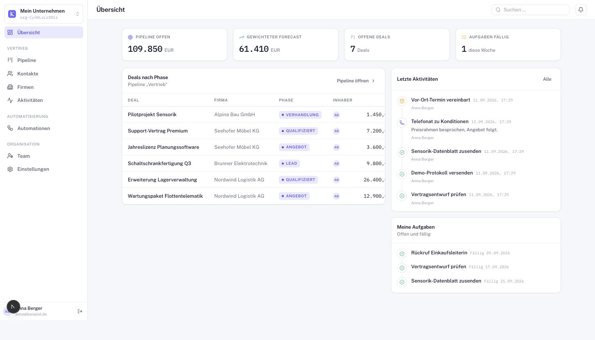
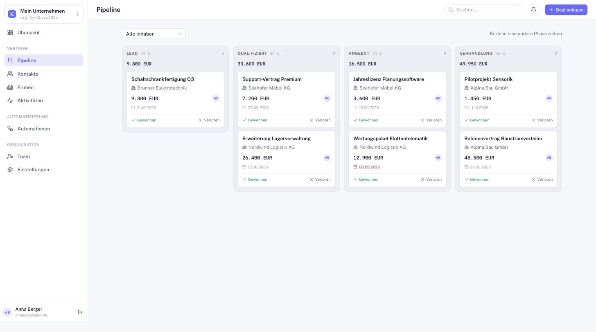
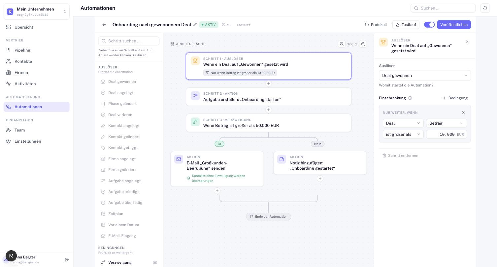

# Kundeo - EARLY BUILD!

**Open-source CRM built for the DACH market — self-hostable first, hosting always in mind.**

Kundeo is a customer-relationship manager with a native German UI, DACH domain
model (USt-IdNr., formal salutations, `DE`/`AT`/`CH`, EUR/CHF) and a built-in
**no-code automation engine**. Every feature runs fully on a single self-hosted
instance with no paid external service required — auth, email and data all have
a self-contained default.

License: [AGPL-3.0-only](./LICENSE) · Stack: Next.js 15 · React 19 · Prisma 6 ·
PostgreSQL 17 · Tailwind v4 · Better Auth · Turborepo · pnpm.

---

## Screenshots

**Dashboard** — weighted forecast, open deals, activity feed and due tasks at a glance.



| Deal pipeline (Kanban) | Automation builder |
| --- | --- |
|  |  |

The automation builder is fully visual and German-language — every node reads as
a plain sentence ("Wenn ein Deal auf ‚Gewonnen' gesetzt wird"), with branches,
conditions, delays and a live run log. No JSON, no `{{ templating }}` in front of
the user.

---

## Features

### CRM
- **Contacts & companies** with DACH fields: `vatId` (USt-IdNr./UID),
  `salutation` (Herr/Frau), formal `title` (Dr./Prof.), address, country
  (`DE`/`AT`/`CH`), industry. DSGVO email consent is tracked per contact.
- **Deal pipeline** as a Kanban board with configurable stages and per-stage
  win probability driving a **weighted forecast**.
- **Effort-based deal value** — deals can be a fixed amount or computed from
  hours/rate over a weekly/monthly/annual period. Money is always stored as
  integer minor units (`amountCents`), never floats.
- **Activities & tasks** — notes, calls, emails, meetings and tasks, with due
  dates, completion and an activity timeline per contact/company/deal.
- **JSON export** of all tenant data via `/api/export`.

### Automations (no-code)
- **Visual flow builder** with triggers, actions, conditions/branches, delays
  and filters — all in German.
- **Triggers**: deal won/created/stage-changed/lost, contact & company
  created/updated/tagged, task created/completed/overdue, fixed **schedules**,
  **relative dates** (e.g. *N days before a renewal or close date*), and inbound
  email.
- **Actions**: create task, add note, send email, move deal, add tag,
  round-robin assign, notify, **webhook**, set field, create record, and
  **sub-flows** (nested automations).
- **Durable execution** — delays suspend a run in the database (no held
  connections) and resume on a 60s ticker; network side-effects (email,
  webhooks) run through a post-commit outbox and are reflected truthfully in the
  run log.
- **Security & compliance built in** — outbound webhooks are **SSRF-guarded**
  (private/loopback/link-local/cloud-metadata IPs blocked, no redirect
  following, optional host allowlist); email sends **respect DSGVO consent** and
  are skipped with an honest log entry when consent is missing.
- Starter **template gallery** to create common workflows in one click.

### Multi-tenancy & security
- Tenant boundary = a Better Auth **organization**. Every tenant-owned row
  carries `organizationId`.
- Isolation is enforced by **PostgreSQL Row-Level Security**, not just `where`
  clauses. The app connects as a restricted, non-owner role; all request-time
  data access goes through `scoped()` / `withOrg()`, which set the active org for
  the transaction so RLS applies.
- Self-host runs a single org; the same schema serves many orgs per database for
  a hosted edition — no reshape needed.

### Pluggable email
Email delivery is swappable behind one interface, chosen by env:
- **`log`** (default) — records the message to the run log, no mail server
  needed. Ideal for self-host out of the box.
- **`smtp`** — any SMTP server via nodemailer.
- **`m365`** — Microsoft 365 / Graph `sendMail` with client credentials.

---

## Quick start (local dev)

Requires Node ≥ 20, pnpm 11, and Docker (for Postgres).

```bash
pnpm install
cp .env.example .env                       # set BETTER_AUTH_SECRET: openssl rand -base64 32
docker compose up -d                       # PostgreSQL 17 on 127.0.0.1:5434
pnpm db:migrate                            # apply schema + Row-Level Security
pnpm db:seed                               # optional: demo org, pipeline, deals & automations
pnpm dev                                   # http://localhost:3000
```

Open http://localhost:3000, **sign up** to create your account. On the
self-hosted edition the first sign-in bootstraps a single organization
automatically.

> The seed creates demo **data** (companies, deals, workflows) but no
> sign-in-able demo user — create your own account via the signup screen.

---

## Configuration

All configuration is env-based (see [`.env.example`](./.env.example)).

| Variable | Purpose |
| --- | --- |
| `DATABASE_URL` | Runtime connection as the restricted `kundeo_app` role (RLS applies). |
| `DIRECT_URL` | Owner connection for migrations/seed (bypasses RLS). |
| `BETTER_AUTH_SECRET` | Auth signing secret — `openssl rand -base64 32`. |
| `BETTER_AUTH_URL` | Public base URL of the app. |
| `KUNDEO_EDITION` | `self-hosted` (default, single org) or `hosted` (org per signup). |
| `KUNDEO_EMAIL_PROVIDER` | `log` (default), `smtp`, or `m365`. |
| `KUNDEO_SMTP_*` | SMTP host/port/secure/user/pass/from (when provider = `smtp`). |
| `KUNDEO_M365_*` | Tenant/client id, secret, sender (when provider = `m365`). |
| `KUNDEO_WEBHOOK_ALLOWED_HOSTS` | Optional comma-separated webhook host allowlist. |
| `KUNDEO_DISABLE_AUTOMATION_TICKER` | Set to `1` to disable the schedule/delay sweeper. |

---

## Project layout

Turborepo monorepo (pnpm workspaces).

| Path | What |
| --- | --- |
| `apps/web` | Next.js App Router app (`output: "standalone"` for Docker). |
| `packages/db` | Prisma schema, generated client, `withOrg()` tenant helper, seed, `rls.sql`. |
| `packages/auth` | Better Auth server (`.`) + browser client (`./client`). |
| `packages/tsconfig` | Shared TypeScript configs. |
| `deploy/` | Deployment assets: production Compose, systemd unit, tarball build, Postgres init (creates the restricted `kundeo_app` role). See [`deploy/README.md`](./deploy/README.md). |

### Scripts

```bash
pnpm dev          # run everything (web on :3000)
pnpm build        # production build
pnpm lint         # eslint
pnpm typecheck    # tsc across the monorepo
pnpm db:migrate   # prisma migrate dev
pnpm db:studio    # prisma studio
pnpm db:seed      # seed demo data
```

---

## Distribution & roadmap

Kundeo is **self-hosted first** and deliberately not coupled to any single
runtime. The app is built for a `standalone` Node output; the packaging around
it — see **[`deploy/`](./deploy/README.md)** for full instructions:

- ✅ Local dev via Docker Compose (Postgres) + `pnpm dev`.
- ✅ Production Docker image (GHCR) + app+db Compose file
  ([`deploy/docker-compose.yml`](./deploy/docker-compose.yml)).
- ✅ Native Linux: `standalone` build under systemd, shipped as a prebuilt
  release tarball ([`deploy/build-tarball.sh`](./deploy/build-tarball.sh),
  [`deploy/systemd/`](./deploy/systemd)).
- ✅ GitHub Actions to publish the image and tarball on tag/release
  ([`.github/workflows/release.yml`](./.github/workflows/release.yml)).

Both deployment paths apply migrations (schema + Row-Level Security) on start
and share one env-based setup. Quick start:

```bash
cd deploy && cp env.example .env   # fill in secrets
docker compose up -d               # app on :3000 + PostgreSQL
```


---

## License

[AGPL-3.0-only](./LICENSE). © Michel Roegl-Brunner and contributors.
